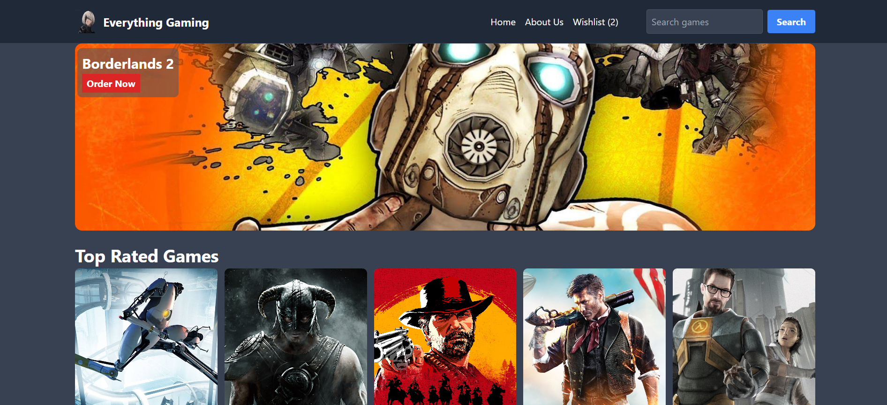

# Everything Gaming - A React Video Game App with a backend API | By Junior Elie MBAKOP

### [What game to play today ?](https://project-react-app-ten.vercel.app/) 🎬

# Introduction

React application to search, discover and comment movies.

# Features

**Add & Delete reviews**  
**Add a game to your wishlist**  
**Search a game**  

# Behind the scene

**Tailwind css for the styling**  
**Manage external API**  
**Handle mock server**  

---

# 🌐 Credits

- External API : [RAWGapi](https://rawg.io/apidocs)
- Mock Server on Render : [GitHub Repo](https://github.com/Juniorelie/game-applist-backend)
